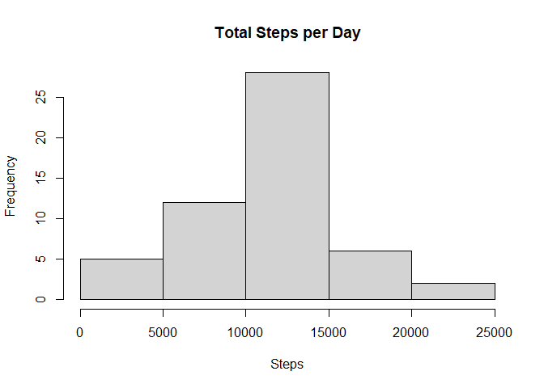
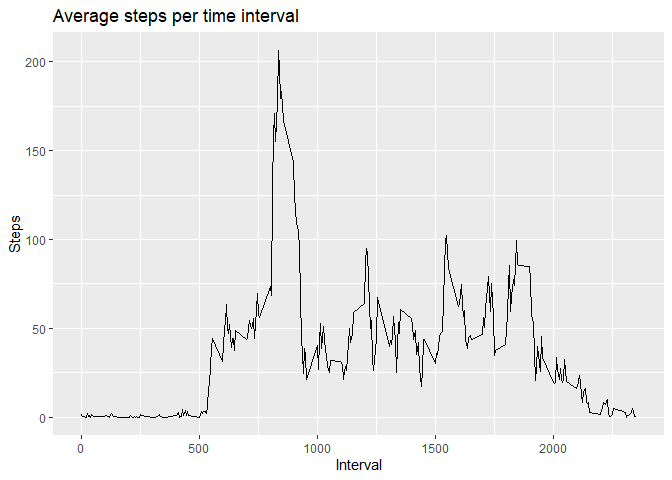
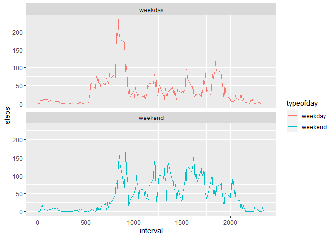

## What is in this report:
1) Code for reading in the activity dataset and processing the data
2) Histogram of the total number of steps taken each day
3) Mean and median number of steps taken each day
4) Time series plot of the average number of steps taken
5) The 5-minute interval that, on average, contains the maximum number of steps
6) Code to describe and show a strategy for imputing missing data
7) Histogram of the total number of steps taken each day after missing values are imputed
8) Panel plot comparing the average number of steps taken per 5-minute interval across weekdays and weekends

As well as all of the R code needed to reproduce the results (numbers, plots, etc.) in the report.

## 1) Code for reading in the activity dataset and processing the data 

This code sets the working directory, reads in the activity dataset using read.csv, loads necessary
libraries, and transforms the date variable.


```r
setwd("H:/Rstudiotest/reproducible")
library(lubridate)
```

```
## Warning: package 'lubridate' was built under R version 4.0.5
```

```
## 
## Attaching package: 'lubridate'
```

```
## The following objects are masked from 'package:base':
## 
##     date, intersect, setdiff, union
```

```r
library(ggplot2)
```

```
## Warning: package 'ggplot2' was built under R version 4.0.5
```

```r
activity <- read.csv("activity.csv")
activity$date <- ymd(activity$date)
```

## 2) Histogram of the total number of steps taken each day

This code creates a dataset of total steps taken each day and creates a histogram from that dataset.


```r
stepsperday <- aggregate(activity$steps ~ activity$date, FUN = sum)
colnames(stepsperday) <- c("Date", "Steps")
hist(stepsperday$Steps, xlab = "Steps", main = "Total Steps per Day")
```

<!-- -->

## 3) Mean and median number of steps taken each day

This code uses the total steps taken each day dataset and calculates the mean and median steps taken
each day.


```r
mean(stepsperday$Steps)
```

```
## [1] 10766.19
```

```r
median(stepsperday$Steps)
```

```
## [1] 10765
```

## 4) Time series plot of the average number of steps taken

This code makes a time series plot of 5-minute intervals and the average number of steps taken, averaged
across all days.


```r
cleanactivity <- activity[!is.na(activity$steps),]
stepsperinterval <- aggregate(steps ~ interval, data = cleanactivity, FUN = mean)
timeplot <- ggplot(stepsperinterval, aes(interval, steps))
timeplot + geom_line(col = "black") + ggtitle("Average steps per time interval") + xlab("Interval") + ylab("Steps")
```

<!-- -->

## 5) The 5-minute interval that, on average, contains the maximum number of steps

This code uses which.max to find out the maximum steps on average across all days.


```r
stepsperinterval[which.max(stepsperinterval$steps),]
```

```
##     interval    steps
## 104      835 206.1698
```

## 6) Code to describe and show a strategy for imputing missing data

This code shows the amount of missing data, and uses the mean number of steps of the five minute interval
to impute the missing data.


```r
sum(is.na(activity$steps))
```

```
## [1] 2304
```

```r
miss <- is.na(activity$steps)
meaninterval <- tapply(activity$steps, activity$interval, mean, na.rm = TRUE, simplify = TRUE)
activityfull <- activity
activityfull$steps[miss] <- meaninterval[activity$interval[miss]]
```

```
## Warning in activityfull$steps[miss] <- meaninterval[activity$interval[miss]]:
## number of items to replace is not a multiple of replacement length
```

## 7) Histogram of the total number of steps taken each day after missing values are imputed

This code uses the activity data with the imputed data to produce a new histogram, and recalculate
the mean and median total number of steps.


```r
stepsperdayfull <- aggregate(activityfull$steps ~ activityfull$date, FUN = sum)
colnames(stepsperdayfull) <- c("Date", "Steps")
hist(stepsperdayfull$Steps, xlab = "Steps", main = "Total Steps per Day - Full Data")
```

<!-- -->

```r
mean(stepsperdayfull$Steps)
```

```
## [1] 9544.637
```

```r
median(stepsperdayfull$Steps)
```

```
## [1] 10395
```

## 8) Panel plot comparing the average number of steps taken per 5-minute interval across weekdays and weekends

This code uses the date variable to create a factor variable of weekdays and weekends, then plots
time series of average steps by five minute interval across the two factors.


```r
activityfull$weekday <- weekdays(activityfull$date)
activityfull$typeofday <- ifelse(activityfull$weekday == "Saturday" | activityfull$weekday == "Sunday", "weekend", "weekday")
stepsperinttypeofday <- aggregate(steps ~ interval + typeofday, data = activityfull, FUN = mean)
timeplottypeofday <- ggplot(stepsperinttypeofday, aes(interval, steps, color = typeofday))
timeplottypeofday + geom_line() + facet_wrap(~typeofday, ncol = 1, nrow = 2)
```

<!-- -->
